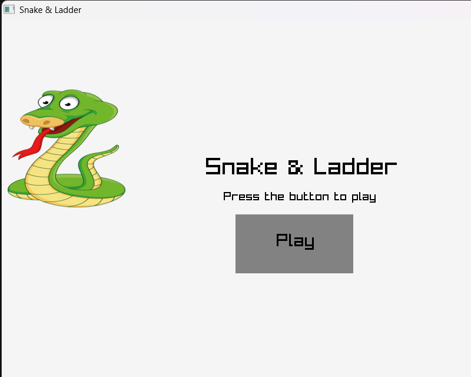
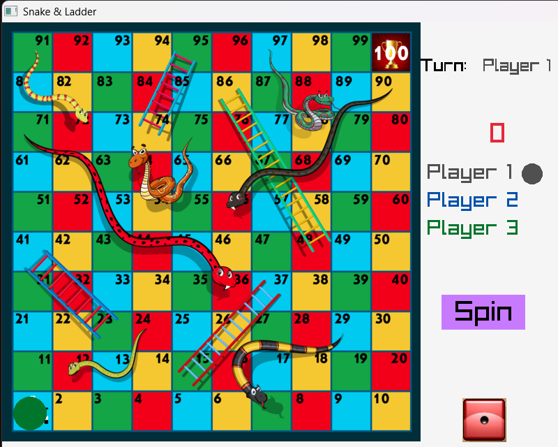

# Snake & Ladder
A simple Snake and Ladder game written in C using the raylib graphics library. The game opens with a title screen, lets three players take turns rolling a dice, moves player tokens across a 100-square board, and shows a game-over screen when a player reaches the final square.

## Preview




## Features
- Three-player local gameplay
- Graphical board, dice, snake, and ladder assets
- Mouse-controlled dice roll
- Turn indicator and player color markers
- Ladder movement based on board positions
- Extra turn when a player rolls 6
- Restart option after the game ends

## Controls
1. Click **Play** on the title screen.
2. Hold the left mouse button on the dice button to spin the dice.
3. Right-click the same button to stop the dice and move the current player.
4. The first player to reach square 100 wins.

## Project Structure
```text
snake_ladder/
+-- assets/          # Images used by the game
+-- bin/             # macOS build output
+-- include/         # raylib headers
+-- lib/             # raylib libraries and DLL
+-- src/main.c       # Game source code
+-- makefile         # macOS build target
+-- compilecommand   # Example compile commands
`-- build_win.exe    # Existing Windows build
```

## Requirements
- 64-bit MinGW GCC on Windows
- C compiler such as `gcc` or `clang` on other platforms
- raylib library and headers
- Windows, macOS, or another platform supported by raylib

The repository already includes raylib headers and libraries in the `include/` and `lib/` folders.

## Build and Run

### Windows
Check that GCC is 64-bit:
```sh
gcc -dumpmachine
```
It should print something like:
```text
x86_64-w64-mingw32
```
Compile:
```sh
gcc src/main.c -I include -o build_win.exe lib/libraylib.a -lopengl32 -lgdi32 -lwinmm
```
Run:
```sh
./build_win.exe
```

### macOS
Compile with the included makefile:
```sh
make build_osx
```
Run:
```sh
./bin/build_osx
```

## Notes
The `compilecommand` file contains extra raylib setup notes and example compile commands. Those notes are useful if raylib needs to be rebuilt or copied into the project again.